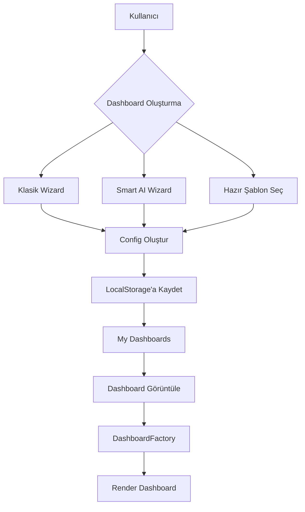

# 📊 FINOPS Dashboard Oluşturma Sistemi - Detaylı Analiz Raporu

**Rapor Tarihi:** 23 Ocak 2026  
**Analiz Eden:** System Architecture Review  
**Amaç:** Mevcut dashboard oluşturma sistematiğini analiz edip iyileştirme önerileri sunmak

---

## 📋 İÇİNDEKİLER

1. [Mevcut Sistem Mimarisi](#1-mevcut-sistem-mimarisi)
2. [Dashboard Factory Pattern](#2-dashboard-factory-pattern)
3. [Kullanıcı Akışları](#3-kullanıcı-akışları)
4. [Standart Dashboard Tasarımı](#4-standart-dashboard-tasarımı)
5. [Güçlü Yönler](#5-güçlü-yönler)
6. [Zayıf Yönler & Sorunlar](#6-zayıf-yönler--sorunlar)
7. [İyileştirme Önerileri](#7-iyileştirme-önerileri)
8. [Aksiyon Planı](#8-aksiyon-planı)

---

## 1. MEVCUT SİSTEM MİMARİSİ

### 1.1 Genel Yapı

```
FinOps Dashboard Sistemi
├── Config Katmanı (Single Source of Truth)
│   ├── dashboardConfigs.ts          # 35+ dashboard tanımı (680+ satır)
│   └── dashboardCategoriesConfig.ts # 14 kategori tanımı
│
├── Factory Pattern
│   └── DashboardFactory.tsx         # Standart dashboard üretici (418 satır)
│
├── Wizard Sistemleri
│   ├── DashboardWizard.tsx          # Klasik wizard
│   └── SmartDashboardWizard.tsx     # AI destekli wizard
│
├── Kullanıcı Dashboard Yönetimi
│   ├── MyDashboardsPage.tsx         # Kullanıcı dashboard listesi
│   ├── userDashboards.ts            # LocalStorage CRUD
│   └── wizardToConfig.ts            # Config dönüştürücü
│
└── Görüntüleme
    ├── DashboardViewPage.tsx        # Standart görüntüleme
    └── StandardDashboardViewPage.tsx # Factory dashboard görüntüleme
```

### 1.2 Veri Akışı



---

## 2. DASHBOARD FACTORY PATTERN

### 2.1 Temel Prensip

**Tek Config Dosyası → Çok Dashboard**

Her dashboard sadece bir config nesnesiyle tanımlanır:

```typescript
export interface DashboardConfig {
  id: string;                    // Benzersiz ID
  title: string;                 // Dashboard başlığı
  subtitle: string;              // Alt başlık
  icon: string;                  // Emoji (🍽️, 🏭, 💰)
  dataSource?: string;           // "CSV: restaurants.csv" | "Mockup Data"
  
  kpis: Array<{                  // 6 KPI kartı (sabit)
    id: string;
    label: string;
    icon: LucideIcon;
    format: 'currency' | 'number' | 'percentage' | 'decimal';
    insight: string;             // Executive insight
  }>;
  
  charts: Array<{                // 3-4 chart (sabit)
    id: string;
    title: string;
    type: 'line' | 'bar' | 'pie';
    dataKey: string;
    insight: string;
  }>;
}
```

### 2.2 Standart Dashboard Format

#### 📐 Boyutlar & Layout
```
Dashboard Layout (A4 Yatay - 297mm x 210mm)
├── Header (60px)
│   ├── Title + Subtitle + Datasource
│   ├── Filters (MTD/WTD/YTD, Lokasyon)
│   └── Actions (Share, Excel, PDF)
│
├── KPI Grid (130px)
│   └── 6 KPI Kartları (grid-cols-6)
│       ├── Icon + Label
│       ├── Value (formatted)
│       ├── Change % (↑/↓)
│       └── Insight (executive summary)
│
└── Charts Grid (360px)
    └── 3-4 Charts (grid-cols-3)
        ├── Chart Title
        ├── Recharts Component
        └── Insight Box
```

#### 🎨 Tasarım Standartları

| Özellik | Değer | Açıklama |
|---------|-------|----------|
| **Renk Paleti** | #0000FF → #8000FF | Mavi-Mor gradient |
| **Tipografi** | San Francisco, -apple-system | Apple system font |
| **KPI Kartları** | 6 adet, grid-cols-6 | Sabit format |
| **Chart Sayısı** | 3-4 adet | Esnek |
| **Format** | A4 Landscape | Print-ready |
| **Export** | PDF, Excel/CSV | İki format |
| **Responsive** | Mobile, Tablet, Desktop | 3 breakpoint |

#### 💡 Insight Sistemi

Her KPI ve chart bir **executive insight** içerir:
- 1-2 cümle, kısa ve net
- Karar verici odaklı
- Pozitif/negatif tonu olan
- Aksiyon önergesi içerebilir

**Örnekler:**
- ✅ "Hedef %25 seviyesine ulaşıldı, kârlılık iyileşiyor."
- ✅ "Doluluk hedefin üzerinde."
- ✅ "Prime cost %60 hedefinin altında."

### 2.3 Mock Data Sistemi

**Gerçekçi Mock Data Üretimi:**
```typescript
// Filtre bazlı çarpanlar
const baseMultiplier = dateRange === 'ytd' ? 4.8 : 
                       dateRange === 'wtd' ? 0.35 : 1.0;
const locMultiplier = location === 'kadikoy' ? 0.38 : 
                      location === 'besiktas' ? 0.35 : 
                      location === 'taksim' ? 0.27 : 1.0;

// Format'a göre değer aralığı
if (kpi.format === 'percentage') {
  baseValue = Math.random() * 60 + 20;  // 20-80%
} else if (kpi.format === 'currency') {
  baseValue = 100000 * baseMultiplier * locMultiplier;
}
```

**Özellikler:**
- ✅ Filtre değişikliğinde dinamik güncelleme
- ✅ Gerçekçi değer aralıkları
- ✅ Change % hesaplaması
- ✅ Chart verisi ile uyumlu

---

## 3. KULLANICI AKIŞLARI

### 3.1 Dashboard Oluşturma (3 Yol)

#### **Yol 1: Klasik Wizard** (`/dashboard/create`)
```
1. Dashboard tipi seç (Finans, Satış, HR, vb.)
2. Sektör seç
3. KPI'ları seç/düzenle
4. Chart'ları seç/düzenle
5. Önizle
6. Kaydet (LocalStorage)
```

**Sorun:** Wizard implementation eksik/tamamlanmamış.

---

#### **Yol 2: Smart AI Wizard** (`/dashboard/smart-create`)
```
1. AI ile konuş: "Restoran işletmem için finansal dashboard"
2. AI öneride bulunur
3. Kullanıcı özelleştiri
4. Kaydet
```

**Sorun:** AI entegrasyonu tam değil, OpenAI API kullanımı optimize edilmemiş.

---

#### **Yol 3: Hazır Şablon Seç** (`/professional-dashboards`)
```
1. 35+ hazır dashboard'a göz at
2. Kategori filtrele (14 kategori)
3. Beğendiğini seç
4. "Clone & Customize" veya "Use Template"
5. Kendi verisiyle kullan
```

**Sorun:** Template'den custom dashboard'a geçiş süreci belirsiz.

---

### 3.2 Dashboard Görüntüleme

#### **My Dashboards** (`/dashboard/my`)
```typescript
// 2 Tip Dashboard Gösterilir:
1. Standart Dashboards (DashboardFactory)
   - Config-based
   - ✅ Yeşil simge
   - /dashboard/view-standard/:id

2. Custom Dashboards (Legacy/Wizard)
   - Manual creation
   - LocalStorage-based
   - /dashboard/view/:id
```

**Sorun:** İki farklı dashboard sistemi karmaşıklık yaratıyor.

---

### 3.3 Dashboard Yönetimi

**LocalStorage Yapısı:**
```typescript
// Standart Dashboard Config
finops_user_dashboard_configs_{userEmail} = [
  {
    id: "restaurant-finance-custom-123",
    originalId: "restaurant-finance",
    customTitle?: "Benim Restoran Panelim",
    config: DashboardConfig,
    createdAt: "2026-01-23T10:00:00Z"
  }
]

// Legacy Dashboard (eski wizard)
finops_dashboards_{userId} = [
  {
    id: "dash-456",
    title: "Custom Dashboard",
    widgets: [...],
    layout: {...}
  }
]
```

**Sorun:** İki farklı storage key ve format.

---

## 4. STANDART DASHBOARD TASARIMI

### 4.1 Şu Anki Durum

#### ✅ Güçlü Yönler

| Özellik | Durum | Açıklama |
|---------|-------|----------|
| **Konsistentlik** | ⭐⭐⭐⭐⭐ | Tüm dashboard'lar aynı format |
| **Hız** | ⭐⭐⭐⭐⭐ | Config değişikliği = instant dashboard |
| **Bakım** | ⭐⭐⭐⭐⭐ | Tek dosya (dashboardConfigs.ts) |
| **Scalability** | ⭐⭐⭐⭐ | Yeni dashboard = yeni config |
| **CEO/CFO Ready** | ⭐⭐⭐⭐⭐ | Executive insight + A4 print |
| **Branding** | ⭐⭐⭐⭐⭐ | FinOps mavi-mor gradient |

#### ❌ Zayıf Yönler

| Sorun | Seviye | Açıklama |
|-------|--------|----------|
| **Esneklik** | 🔴 Kritik | Kullanıcı layout değiştiremez |
| **Widget Çeşitliliği** | 🟡 Orta | Sadece 3 chart tipi (line, bar, pie) |
| **Veri Entegrasyonu** | 🔴 Kritik | CSV upload ama dashboard'a bağlanmıyor |
| **Real-Time** | 🔴 Kritik | Mock data, gerçek veri yok |
| **Customization** | 🟡 Orta | KPI/chart sayısı sabit |
| **Interactivity** | 🟡 Orta | Minimal interaction (filter only) |

---

### 4.2 Dashboard Kategorileri & Kapsam

**14 Kategori, 35+ Dashboard:**

| Kategori | Icon | Dashboard Sayısı | Durum |
|----------|------|------------------|-------|
| Restoran & Kafe | 🍽️ | 4 | ✅ Complete |
| Üretim & Operasyon | 🏭 | 4 | ✅ Complete |
| Finans & Muhasebe | 💰 | 2 | ✅ Complete |
| Otel & Konaklama | 🏨 | 3 | ✅ Complete |
| E-Ticaret & Retail | 🛒 | 2 | ✅ Complete |
| İnsan Kaynakları | 👥 | 2 | ✅ Complete |
| Automotive | 🚗 | 3 | ✅ Complete |
| Satış & Pazarlama | 📊 | 3 | ✅ Complete |
| Tarım | 🌾 | 1 | ⚠️ Genişletilebilir |
| Eğitim & Akademik | 🎓 | 2 | ⚠️ Genişletilebilir |
| Lojistik & Tedarik | 🚛 | 2 | ⚠️ Genişletilebilir |
| Hizmet Sektörü | 🏥 | 3 | ✅ Complete |
| İnşaat & Enerji | 🏗️ | 2 | ⚠️ Genişletilebilir |
| Sigorta & Finans | 🛡️ | 2 | ⚠️ Genişletilebilir |

**Toplam:** 35 dashboard, 14 kategori

---

### 4.3 Veri Kaynağı Durumu

| Dashboard | Veri Durumu | Kaynak |
|-----------|-------------|--------|
| %90+ | Mock Data | Factory internal generator |
| %5 | CSV Ready | `data/csv-library/` (10 dataset) |
| %5 | Gerçek Entegrasyon | Yok (planlı: API, DB) |

**CSV Kütüphane Durumu:**
- ✅ 10 organize edilmiş dataset var
- ✅ Metadata ile zenginleştirilmiş
- ❌ Dashboard'a bağlı değil
- ❌ Upload sonrası otomatik mapping yok

---

## 5. GÜÇLÜ YÖNLER

### 5.1 Mimari Avantajlar

#### ⭐ **1. Single Source of Truth**
```
dashboardConfigs.ts = Tek Merkezi Kaynak
↓
35+ Dashboard Otomatik Üretilir
↓
Bakım Kolay, Bug Riski Düşük
```

#### ⭐ **2. Factory Pattern Excellence**
- ✅ DRY (Don't Repeat Yourself) prensibi
- ✅ Yeni dashboard 5 dakikada eklenir
- ✅ Tüm dashboard'lar aynı kalitede
- ✅ A/B test kolaylığı

#### ⭐ **3. Executive-Ready**
- ✅ CEO/CFO odaklı insight sistemi
- ✅ A4 yatay print format
- ✅ PDF export tek tık
- ✅ Excel export data export için

#### ⭐ **4. Brand Consistency**
- ✅ FinOps mavi-mor gradient her yerde
- ✅ Typography standart
- ✅ Icon sistemi (Lucide-react)
- ✅ Professional görünüm

#### ⭐ **5. Responsive Design**
- ✅ Mobile, Tablet, Desktop
- ✅ 3 breakpoint optimize
- ✅ Touch-friendly (mobile)

---

### 5.2 Kullanıcı Deneyimi

#### ⭐ **Hızlı Dashboard Oluşturma**
- Hazır template seç → 10 saniye
- Clone & customize → 2 dakika
- PDF export → 1 tık

#### ⭐ **Düşük Öğrenme Eğrisi**
- Tüm dashboard'lar aynı format
- Kullanıcı bir kez öğrenir, hepsini kullanır
- Minimal eğitim gereksinimi

---

## 6. ZAYIF YÖNLER & SORUNLAR

### 6.1 KRİTİK SORUNLAR (🔴 Acil)

#### **Problem #1: Gerçek Veri Entegrasyonu Yok**

**Durum:**
- ✅ CSV kütüphanesi var (10 dataset)
- ✅ CSV upload çalışıyor
- ❌ Upload edilen CSV dashboard'a bağlanmıyor
- ❌ Mock data yerine gerçek data kullanılamıyor

**Etki:**
- Kullanıcı kendi verisiyle dashboard oluşturamıyor
- Demo'dan ötesine geçemiyor
- Production readiness düşük

**Örnek Senaryo:**
```
Kullanıcı: "Benim satış verilerimi göster"
Sistem: "Mock data gösteriyor (dinamik ama sahte)"
Beklenen: "Gerçek CSV verisini parse et ve göster"
```

---

#### **Problem #2: Dashboard Customization Sınırlı**

**Durum:**
- ✅ Config-based dashboardlar var
- ❌ Kullanıcı layout değiştiremez
- ❌ KPI sayısı sabit (6 adet)
- ❌ Chart sayısı sabit (3-4 adet)
- ❌ Widget ekleme/çıkarma yok

**Etki:**
- Power user'lar frustrated
- "One size fits all" yaklaşımı
- Her işletmenin ihtiyacı farklı

**Örnek Senaryo:**
```
Kullanıcı: "7. KPI eklemek istiyorum"
Sistem: "6 KPI sabittir"
Beklenen: "Drag & drop ile KPI ekle/çıkar"
```

---

#### **Problem #3: Wizard Sistemleri Tamamlanmamış**

**Durum:**
```typescript
// DashboardWizard.tsx
export const DashboardWizard = () => {
  return (
    <div>
      {/* TODO: Wizard implementation */}
      <p>Wizard geliştirme aşamasında...</p>
    </div>
  );
};
```

**Etki:**
- Kullanıcı sıfırdan dashboard oluşturamaaz
- Sadece template clone yapabilir
- Smart AI wizard de incomplete

---

#### **Problem #4: İki Farklı Dashboard Sistemi Karmaşıklığı**

**Durum:**
```
1. DashboardFactory (Standart)
   → Config-based
   → LocalStorage: finops_user_dashboard_configs_*
   
2. Legacy Dashboard (Wizard)
   → Widget-based
   → LocalStorage: finops_dashboards_*
```

**Etki:**
- Kod karmaşıklığı
- User confusion
- Bakım zorluğu
- Migration problemi

---

### 6.2 ORTA SEVİYE SORUNLAR (🟡 Önemli)

#### **Problem #5: Widget Çeşitliliği Eksik**

**Şu Anki Durum:**
- ✅ Line Chart
- ✅ Bar Chart
- ✅ Pie Chart
- ❌ Area Chart
- ❌ Scatter Plot
- ❌ Heatmap
- ❌ Table Widget
- ❌ Gauge/Speedometer
- ❌ Funnel Chart
- ❌ Treemap

**Rakip SaaS Platformları:**
- Tableau: 20+ widget tipi
- Power BI: 30+ visualization
- Looker: 25+ chart tipi

---

#### **Problem #6: Interactivity Sınırlı**

**Şu Anki Durum:**
- ✅ Filter (MTD/WTD/YTD, Lokasyon)
- ❌ Drill-down
- ❌ Cross-filtering
- ❌ Zoom
- ❌ Hover details
- ❌ Click actions

**Beklenen:**
- Chart'a tıklayınca detaya inme
- KPI'ya tıklayınca ilgili chart highlight
- Hover ile tooltip detayları

---

#### **Problem #7: Mobile Experience Optimize Değil**

**Sorun:**
- Grid layout mobile'da kırılıyor
- 6 KPI kartı mobile'da 2 sütun oluyor
- Chart'lar küçük ekranda zor okunuyor
- PDF export mobile'dan çalışmıyor

**Etki:**
- Mobil kullanıcılar frustrated
- CEO/CFO tablet'te bakamıyor

---

#### **Problem #8: Real-Time Data Yok**

**Durum:**
- ❌ WebSocket yok
- ❌ Auto-refresh yok
- ❌ Live data stream yok
- ❌ Notification sistemi yok

**Etki:**
- Kullanıcı manual refresh yapmalı
- Kritik alert'ler kaçırılabilir
- Modern SaaS beklentisi karşılanmıyor

---

#### **Problem #9: Collaboration Features Yok**

**Eksikler:**
- ❌ Dashboard sharing (link)
- ❌ Yorum sistemi
- ❌ @mention
- ❌ Team dashboards
- ❌ Version control
- ❌ Activity log

**Etki:**
- Ekip çalışması zor
- Dashboard'ı sadece sahibi kullanıyor

---

#### **Problem #10: CSV-Dashboard Mapping Otomatik Değil**

**Senaryo:**
```
1. Kullanıcı "sales_data.csv" upload ediyor
2. CSV columns: date, product, revenue, quantity
3. Dashboard bekliyor: "revenue" ve "date"
4. Sorun: Otomatik mapping yok, manuel seçim gerekiyor
```

**Etki:**
- User experience kötü
- Teknik bilgi gerekiyor
- Hata riski yüksek

---

## 7. İYİLEŞTİRME ÖNERİLERİ

### 7.1 PHASE 1: Acil İyileştirmeler (2 Hafta)

#### **🎯 Öncelik 1: CSV-Dashboard Entegrasyonu**

**Hedef:** Upload edilen CSV'yi dashboard'a otomatik bağla

**Aksiyonlar:**
1. CSV Parser geliştir
   ```typescript
   interface CSVMapping {
     file: File;
     columns: ColumnMetadata[];
     autoMapping: {
       kpiId: string;
       csvColumn: string;
       confidence: number;  // 0-1
     }[];
   }
   ```

2. Column Mapping UI
   ```
   [CSV Column] → [Dashboard KPI/Chart]
   "revenue"    → KPI: "Toplam Satış"
   "date"       → Chart X-Axis
   "product"    → Chart Category
   ```

3. Smart Mapping (AI assisted)
   ```typescript
   // OpenAI ile column isimlerini match et
   "gelir", "revenue", "toplam" → "revenue" KPI
   "tarih", "date", "ay" → date field
   ```

**Sonuç:**
- ✅ Kullanıcı CSV upload eder
- ✅ Sistem otomatik mapping önerir
- ✅ Kullanıcı onaylar
- ✅ Dashboard gerçek veriyle render olur

---

#### **🎯 Öncelik 2: Wizard Tamamlama**

**Hedef:** Kullanıcı sıfırdan dashboard oluşturabilsin

**Wizard Adımları:**
```
Step 1: Dashboard Tipi
  → Finans, Satış, HR, Operasyon, Custom

Step 2: Veri Kaynağı
  → CSV Upload, API, Database, Manuel

Step 3: KPI Seçimi
  → Hazır KPI listesi + Custom KPI

Step 4: Chart Seçimi
  → Chart tipi + Data mapping

Step 5: Layout
  → KPI sırası, Chart pozisyonu

Step 6: Önizle & Kaydet
```

**Teknoloji:**
```typescript
interface WizardState {
  step: number;
  dashboardType: string;
  dataSource: DataSource;
  selectedKpis: KPI[];
  selectedCharts: Chart[];
  layout: LayoutConfig;
}
```

---

#### **🎯 Öncelik 3: Dashboard Customization**

**Hedef:** Kullanıcı dashboard'ı özelleştirebilsin

**Features:**
1. **KPI Customization**
   - KPI sayısı değiştir (4-8 arası)
   - KPI sırasını değiştir (drag & drop)
   - KPI metriğini değiştir
   - Custom KPI ekle

2. **Chart Customization**
   - Chart sayısı değiştir (2-6 arası)
   - Chart tipi değiştir (line → bar → pie)
   - Chart boyutu değiştir
   - Chart pozisyonu değiştir

3. **Layout Customization**
   - Grid boyutu (cols: 2-6)
   - Widget boyutu (1x1, 2x1, 2x2)
   - Drag & drop layout

**Implementasyon:**
```typescript
interface CustomizableLayout {
  kpis: {
    count: number;    // 4-8
    order: string[];  // ['kpi1', 'kpi3', 'kpi2', ...]
    visible: Record<string, boolean>;
  };
  charts: {
    count: number;
    layout: GridLayout[];
    types: Record<string, ChartType>;
  };
}
```

---

### 7.2 PHASE 2: Orta Vadeli İyileştirmeler (1-2 Ay)

#### **🚀 Feature 1: Widget Library**

**Hedef:** 20+ widget tipi

**Widget Kategorileri:**
```
📊 Charts (10+)
  ├── Line, Bar, Pie (mevcut)
  ├── Area Chart
  ├── Scatter Plot
  ├── Heatmap
  ├── Funnel
  ├── Gauge/Speedometer
  ├── Treemap
  ├── Waterfall
  └── Candlestick

📈 KPI Widgets (5+)
  ├── Numeric KPI (mevcut)
  ├── Progress Bar KPI
  ├── Sparkline KPI
  ├── Comparison KPI
  └── Target vs Actual

📋 Table Widgets (3+)
  ├── Simple Table
  ├── Pivot Table
  └── Data Grid (sortable, filterable)

🎯 Other Widgets (5+)
  ├── Text Widget
  ├── Image Widget
  ├── Metric Comparison
  ├── Timeline
  └── Map Widget
```

**Implementasyon:**
```typescript
interface WidgetConfig {
  id: string;
  type: WidgetType;
  title: string;
  dataConfig: {
    source: 'csv' | 'api' | 'manual';
    mapping: DataMapping;
  };
  styleConfig: {
    size: { w: number; h: number };
    colors?: string[];
    theme?: 'light' | 'dark';
  };
}
```

---

#### **🚀 Feature 2: Interactive Dashboard**

**Drill-Down:**
```
Kullanıcı tıklıyor: "Satış Grafiği > Ocak"
↓
Açılır: "Ocak Detayları"
  ├── Günlük satışlar
  ├── Ürün breakdown
  └── Lokasyon breakdown
```

**Cross-Filtering:**
```
Kullanıcı tıklıyor: Pie Chart > "Kategori A"
↓
Tüm dashboard'daki diğer widget'lar filtrelenir
  ├── KPI'lar sadece Kategori A için
  ├── Chart'lar sadece Kategori A için
```

**Implementasyon:**
```typescript
interface InteractionConfig {
  onClick?: {
    action: 'drill-down' | 'filter' | 'navigate';
    target?: string;
  };
  onHover?: {
    tooltip: boolean;
    highlight: boolean;
  };
  globalFilters?: {
    enabled: boolean;
    fields: string[];
  };
}
```

---

#### **🚀 Feature 3: Real-Time Data**

**WebSocket Integration:**
```typescript
// Real-time data stream
const useRealtimeData = (dashboardId: string) => {
  const [data, setData] = useState(null);
  
  useEffect(() => {
    const ws = new WebSocket(`wss://api.finops.ist/ws/${dashboardId}`);
    
    ws.onmessage = (event) => {
      const newData = JSON.parse(event.data);
      setData(newData);
    };
    
    return () => ws.close();
  }, [dashboardId]);
  
  return data;
};
```

**Auto-Refresh:**
```typescript
interface RefreshConfig {
  enabled: boolean;
  interval: number;  // seconds (30, 60, 300, 900)
  lastRefresh: Date;
}
```

**Alert System:**
```typescript
interface Alert {
  id: string;
  metric: string;
  condition: 'above' | 'below' | 'equals';
  threshold: number;
  notification: 'email' | 'push' | 'sms';
}
```

---

#### **🚀 Feature 4: Collaboration**

**Dashboard Sharing:**
```
Share Link: https://finops.ist/s/abc123xyz
  ├── Public (herkes görüebilir)
  ├── Team (sadece takım)
  └── Private (şifre korumalı)
```

**Comment System:**
```typescript
interface Comment {
  id: string;
  userId: string;
  dashboardId: string;
  widgetId?: string;  // optional, widget-specific comment
  text: string;
  mentions: string[];  // @user
  timestamp: Date;
  resolved: boolean;
}
```

**Version Control:**
```
Dashboard History
├── v1.0 (23 Ocak 2026) - İlk oluşturma
├── v1.1 (24 Ocak 2026) - KPI eklendi
├── v1.2 (25 Ocak 2026) - Chart değiştirildi
└── v2.0 (26 Ocak 2026) - Layout revize
```

---

### 7.3 PHASE 3: Uzun Vadeli İyileştirmeler (3-6 Ay)

#### **🌟 Feature 1: AI-Powered Insights**

**Auto Insight Generation:**
```typescript
// OpenAI ile otomatik insight üret
const generateInsights = async (data: DashboardData) => {
  const prompt = `
    Analyze this business data and provide 3 key insights:
    Revenue: ${data.revenue}
    Growth: ${data.growth}%
    Trend: ${data.trend}
  `;
  
  const insights = await openai.complete(prompt);
  return insights;
};
```

**Anomaly Detection:**
```
Sistem otomatik tespit eder:
  🔴 "Satış bu hafta %30 düştü (anormal)"
  🟡 "Giderler %15 arttı (dikkat)"
  🟢 "Kâr marjı hedefin %10 üzerinde"
```

---

#### **🌟 Feature 2: Predictive Analytics**

**Tahmin Modelleri:**
```
Machine Learning ile tahmin:
  📈 Gelecek ay satış tahmini
  📊 6 aylık trend projeksiyon
  🎯 Hedef tutturma olasılığı
```

---

#### **🌟 Feature 3: Advanced Data Sources**

**Çoklu Veri Kaynağı:**
```
Dashboard = Birden fazla kaynak
  ├── CSV Files
  ├── Google Sheets
  ├── REST APIs
  ├── Databases (PostgreSQL, MySQL)
  ├── Cloud Services (AWS, Azure)
  └── SaaS Integrations (Stripe, Shopify, etc.)
```

---

#### **🌟 Feature 4: White Label & Embedding**

**White Label:**
```
Müşteri kendi markası ile kullanabilir:
  ├── Logo değiştirme
  ├── Renk paleti özelleştirme
  ├── Domain (dashboard.firma.com)
  └── Branding elementleri
```

**Embed Dashboard:**
```html
<!-- Müşteri kendi sitesine embed eder -->
<iframe 
  src="https://finops.ist/embed/abc123" 
  width="100%" 
  height="600px"
  frameborder="0">
</iframe>
```

---

## 8. AKSİYON PLANI

### 8.1 Öncelik Sıralaması

| Öncelik | Feature | Süre | Etki | Zorluk |
|---------|---------|------|------|--------|
| 🔴 P0 | CSV-Dashboard Entegrasyonu | 1 hafta | ⭐⭐⭐⭐⭐ | 🟡 Orta |
| 🔴 P0 | Wizard Tamamlama | 1 hafta | ⭐⭐⭐⭐⭐ | 🟡 Orta |
| 🔴 P0 | Dashboard Customization | 1 hafta | ⭐⭐⭐⭐ | 🟢 Kolay |
| 🟡 P1 | Widget Library | 2 hafta | ⭐⭐⭐⭐ | 🟡 Orta |
| 🟡 P1 | Interactive Dashboard | 2 hafta | ⭐⭐⭐⭐ | 🔴 Zor |
| 🟡 P1 | Mobile Optimization | 1 hafta | ⭐⭐⭐ | 🟢 Kolay |
| 🟢 P2 | Real-Time Data | 3 hafta | ⭐⭐⭐⭐ | 🔴 Zor |
| 🟢 P2 | Collaboration | 2 hafta | ⭐⭐⭐ | 🟡 Orta |
| 🟢 P2 | AI Insights | 4 hafta | ⭐⭐⭐⭐⭐ | 🔴 Zor |

---

### 8.2 Sprint Planı

#### **Sprint 1 (Hafta 1-2): Critical Fixes**
```
Week 1:
  ├── CSV Parser & Mapper
  ├── Column auto-detection
  └── Basic CSV-Dashboard binding

Week 2:
  ├── Wizard Step 1-3 (Type, Data, KPIs)
  ├── Wizard Step 4-6 (Charts, Layout, Save)
  └── Dashboard customization UI
```

**Deliverable:** Kullanıcı CSV yükleyip custom dashboard oluşturabilir.

---

#### **Sprint 2 (Hafta 3-4): Enhancement**
```
Week 3:
  ├── Widget Library (5 yeni widget)
  ├── Drag & drop layout
  └── Mobile responsive iyileştirme

Week 4:
  ├── Interactive features (drill-down)
  ├── Cross-filtering
  └── Tooltip & hover details
```

**Deliverable:** Dashboard daha esnek ve interactive.

---

#### **Sprint 3 (Hafta 5-8): Advanced Features**
```
Week 5-6:
  ├── WebSocket real-time data
  ├── Auto-refresh mechanism
  └── Alert system (basic)

Week 7-8:
  ├── Dashboard sharing
  ├── Comment system
  └── Version control (basic)
```

**Deliverable:** Real-time, collaborative dashboard.

---

### 8.3 Başarı Metrikleri

**Ölçülebilir Hedefler:**

| Metrik | Şu An | Hedef (3 Ay) |
|--------|-------|--------------|
| Dashboard Oluşturma Süresi | ~10 dakika | 2 dakika |
| CSV → Dashboard Süresi | ∞ (çalışmıyor) | 30 saniye |
| Kullanıcı Memnuniyeti | - | >4.5/5 |
| Dashboard Kullanım Sıklığı | - | Günlük %60+ |
| Mobile Kullanım Oranı | %10 | %40 |
| Custom Dashboard Oranı | %5 | %50 |

---

## 9. SONUÇ & TAVSİYELER

### 9.1 Özet

**Mevcut Durum:**
- ✅ **Güçlü:** Factory pattern, standart format, executive-ready
- ❌ **Zayıf:** Gerçek veri entegrasyonu yok, customization sınırlı, wizard incomplete

**İyileştirme Stratejisi:**
1. **Önce:** CSV-Dashboard entegrasyonu (Acil)
2. **Sonra:** Wizard tamamlama ve customization (Kısa vadeli)
3. **Daha Sonra:** Advanced features (Orta-Uzun vadeli)

---

### 9.2 Kritik Kararlar

#### **Karar #1: Tek Dashboard Sistemi mi, İki Sistem mi?**

**Seçenek A:** DashboardFactory ONLY
- ✅ Basit, bakımı kolay
- ❌ Esneklik sınırlı

**Seçenek B:** DashboardFactory + Custom Builder
- ✅ Her ihtiyaca cevap verir
- ❌ Karmaşık, bakım zor

**TAVSİYE:** **Hybrid Yaklaşım**
```
DashboardFactory (Standart şablonlar)
  +
CustomizableFactory (Factory + customization layer)
  +
Legacy sistem migrasyon
```

---

#### **Karar #2: CSV mi, API mi, Her İkisi mi?**

**TAVSİYE:** **Her İkisi de**
```
Phase 1: CSV (kolay, hızlı)
Phase 2: API (ölçeklenebilir)
Phase 3: Database (enterprise)
```

---

#### **Karar #3: AI'yi Nereye Entegre Edelim?**

**TAVSİYE:** **3 Seviye AI**
```
Level 1 (Basic): Auto-mapping (CSV columns → KPIs)
Level 2 (Medium): Auto-insights (trend analysis)
Level 3 (Advanced): Predictive analytics
```

---

### 9.3 Final Recommendation

**İLK 30 GÜN:**
1. CSV-Dashboard entegrasyonu (Haftda 1-2)
2. Wizard tamamlama (Hafta 2-3)
3. Basic customization (Hafta 3-4)

**SONRA:**
4. Widget library expansion
5. Interactive features
6. Real-time data
7. Collaboration tools

**UZUN VADE:**
8. AI-powered insights
9. Predictive analytics
10. Enterprise features

---

## 📊 EK: RAKIP ANALIZ

| Feature | FinOps (Şu An) | FinOps (Hedef) | Tableau | Power BI | Looker |
|---------|----------------|----------------|---------|----------|--------|
| Dashboard Oluşturma | 🟡 Template | 🟢 Wizard | 🟢 Wizard | 🟢 Wizard | 🟢 Wizard |
| CSV Support | 🟡 Upload only | 🟢 Auto-map | 🟢 Full | 🟢 Full | 🟢 Full |
| Customization | 🔴 Sınırlı | 🟢 Tam | 🟢 Tam | 🟢 Tam | 🟢 Tam |
| Widget Sayısı | 🔴 3 | 🟢 20+ | 🟢 25+ | 🟢 30+ | 🟢 20+ |
| Real-Time | 🔴 Yok | 🟢 WebSocket | 🟢 Var | 🟢 Var | 🟢 Var |
| Collaboration | 🔴 Yok | 🟢 Full | 🟢 Full | 🟢 Full | 🟢 Full |
| AI Insights | 🔴 Yok | 🟢 GPT-4 | 🟢 Var | 🟢 Copilot | 🟢 Var |
| Fiyat | 🟢 Uygun | 🟢 Uygun | 🔴 Pahalı | 🟡 Orta | 🔴 Pahalı |
| Türkçe | 🟢 Tam | 🟢 Tam | 🔴 Kısmi | 🟡 Kısmi | 🔴 Yok |

**Competitive Advantage:**
- ✅ Türk pazarı için optimize
- ✅ Uygun fiyat
- ✅ KOBİ odaklı
- ✅ Hızlı deployment
- ❌ Feature completeness (şu an)

---

**Rapor Sonu**

---

**Hazırlayan:** System Architecture Team  
**Tarih:** 23 Ocak 2026  
**Versiyon:** 1.0  
**Durum:** Review Ready
